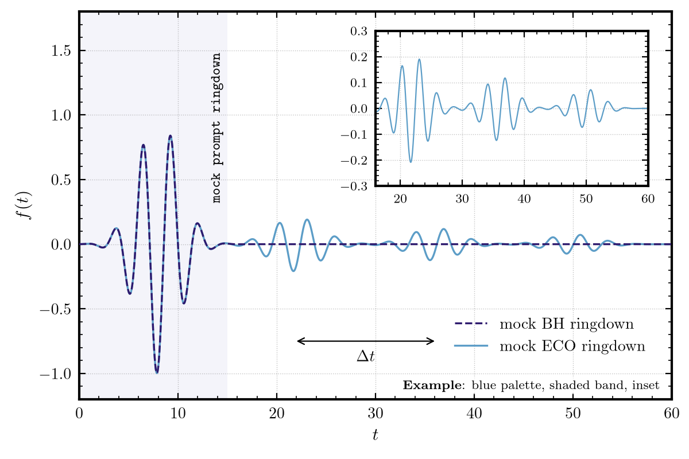
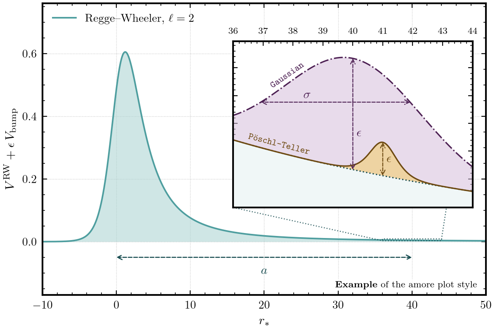
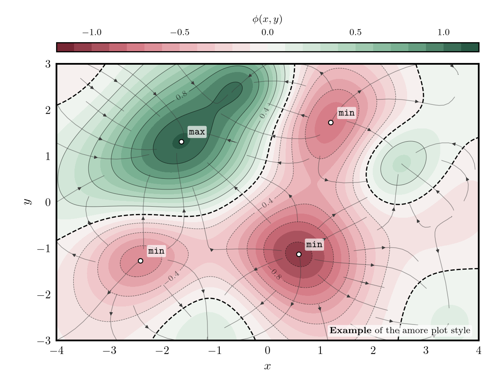
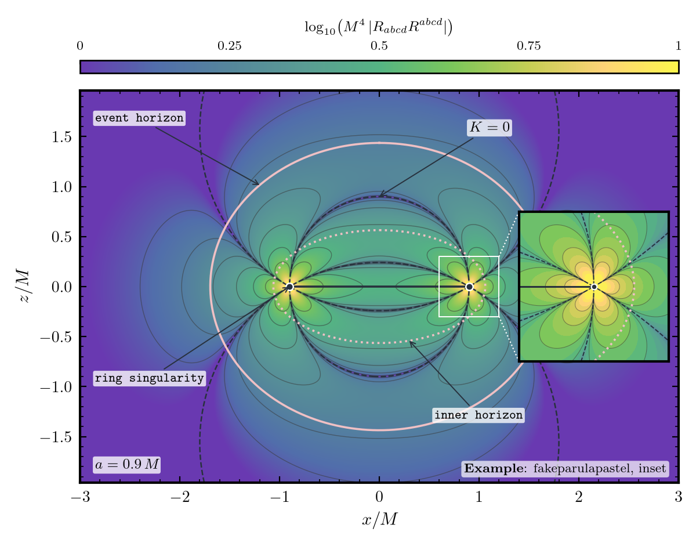
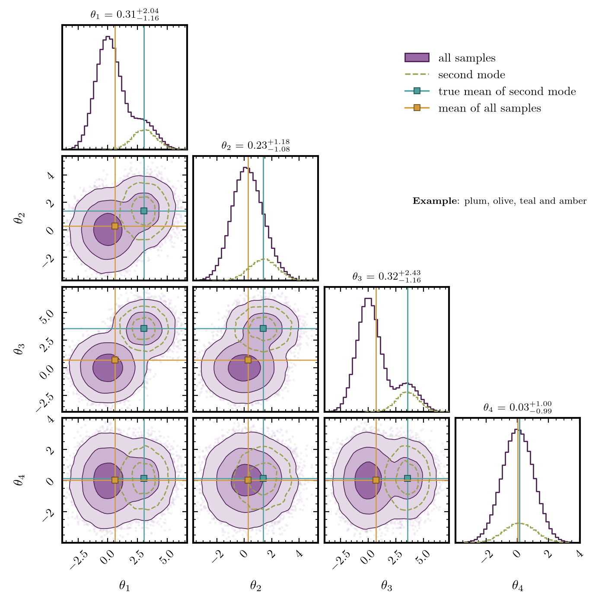
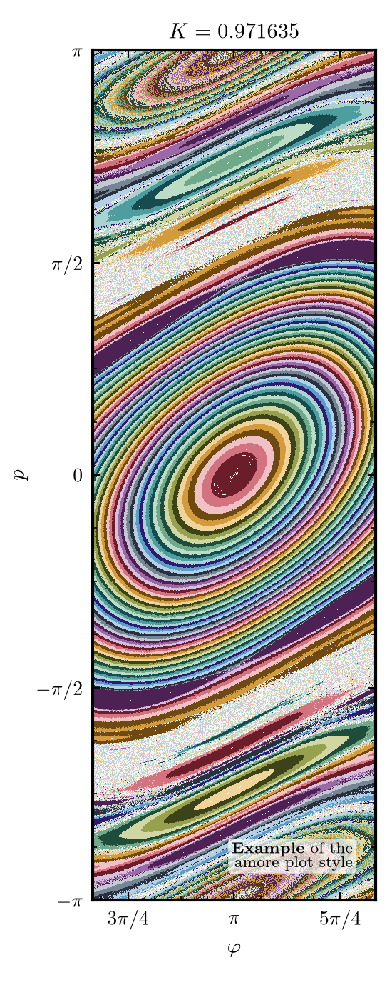
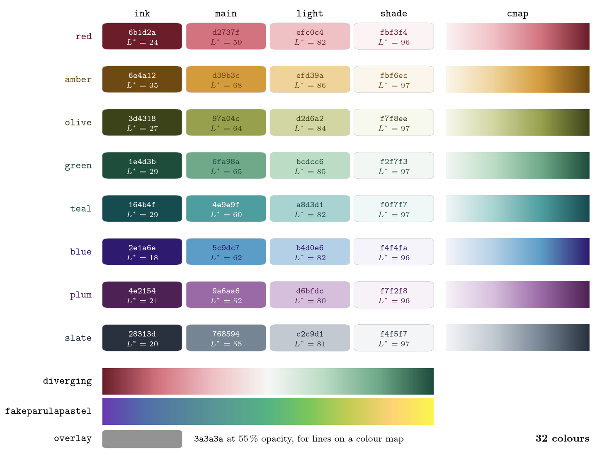

# slop2science

> *"Staying afloat in this torrent of slop requires scrutinising everything the model
> produces."*
> — Loader, Oppenheim & Osborne, [How to Train Your Slop Cannon](https://github.com/Open-Science-Ledger/how-to-train-your-slop-cannon)

This is a Claude Code template. Use it to reproduce a scientific paper and then build new work
on that paper. It contains the reusable parts: instructions, subagents, skills, hooks, a
validation protocol and an audit workflow. It contains no content from any one paper.

The reproduction shows that the setup is sound. The new work is the goal. The new work ends in
a set of new calculations. You can include these calculations in a future publication.

The project tracks the two parts side by side and judges them against different things. It
judges a reproduction against the source. It cannot judge an extension against the source,
because the source does not contain the answer.

You decide the question, the conventions, the scope, what you claim and which language does
what. Claude advises and implements. Claude can disagree one time and gives its reasons. If you
say no, the decision is final. The charter states this rule.

## Features

- Source audit before any code. The audit reconstructs the paper first. It records each
  inconsistency in a five-point form. It never corrects an inconsistency silently.
- Reproduction and extension, tracked side by side. Each has its own standard of evidence. The
  extension ends in a set of new calculations for a possible publication.
- Mathematica, Python and Julia each own named topics. An ownership registry records the
  owners. The project generates code from the algebra. It never retypes code.
- Independent verification. The verifier sees only the artifact. A hook blocks its file edits,
  and it writes only its own audit report. Another hook detects a shell write. Each result has a
  record of how the project produced it.
- Continuity between sessions. The project keeps the current status, a handoff note and the
  captured prompts. Guards protect the sources and the accepted results.
- Simplified Technical English. All prose follows ASD-STE100: the documents, the code comments,
  the commit messages and what Claude writes to you. A lint in `make check` enforces the
  measurable rules.
- One plot style, `amore`, for every figure. I developed it over the past few years for the
  figures in my own papers.

<p align="center">
  
  
</p>
<p align="center">
  
  
</p>

<p align="center">
  
  
</p>

`docs/failure_modes.md` lists the failure that each feature prevents and the cost of each fix.

## Quick start

```bash
git clone <this repo> my-paper-project
cd my-paper-project && rm -rf .git && git init
```

Then run `/init-paper` in Claude Code. For the paper, give it one of these:

- an arXiv link. Claude fetches the LaTeX source, the PDF and the details of the paper.
- a BibTeX entry and the PDF. Put both in `papers/_drop/` first. Claude checks the entry against
  the PDF.

In both cases Claude registers the paper. You do not edit `papers/sources.yaml`. `/init-paper`
then asks you for these items:

- the project name
- your name for the documents, and the licence
- what you want to establish, including the new work beyond the paper
- the topics, and which tool owns which topic
- which libraries you need
- which equations, tables and figures of the paper you want to reproduce

The full list of questions is in section 1 of `.claude/skills/init-paper/SKILL.md`.

It then fills in the placeholders, writes the ownership registry and creates the first prompt
record. It tells you what remains. It refuses to run a second time. Then run `/source-audit`.
Do not write code before the audit.

```bash
make check       # repository checks; needs no scientific toolchain
make check-env   # what is installed here
```

## Tools and libraries

I use Mathematica, Python and Julia. The template has a configuration for all three.

- Julia and Python each get their own environment if you use them. Julia uses `Project.toml` and
  `Manifest.toml`. Python uses a virtual environment that [uv](https://docs.astral.sh/uv/) creates
  from `pyproject.toml` and `uv.lock`. A language that you do not use has no environment.
- `/init-paper` asks which libraries you need. It starts from a short default list. For Python the
  list is numpy, scipy, mpmath, sympy, matplotlib and corner. For Julia it is the linear algebra,
  extended-precision and JSON packages. The project installs only the libraries that you choose.
- Any of the three tools can own any topic. If you do not choose, the default profile applies.
  Mathematica does algebra, in plain `.wls` scripts. Julia does numerics. Python does plotting and
  ML. `/init-paper` lets you change this. The registry in `docs/toolchain.md` records each choice.
  With three capable tools, it is easy to derive one equation twice, and each version can pass its
  own checks. Claude does not move work between languages by itself.
- The project prefers the arXiv LaTeX source to the PDF. The `.tex` file is what the authors
  wrote. Text extraction from a PDF is a reconstruction. The tarball also contains the figures and
  sometimes the data.
- If you keep a Zotero or Calibre library, the project can search it. It can import one item, with
  full metadata and BibTeX, into `papers/imported/`. The tool is read-only and has no browse mode,
  because a large library fills the context of a session. It marks each import unverified until a
  person compares it with the paper. It never reads your notes and annotations.

  ```bash
  scripts/py scripts/library.py search --author Chandrasekhar
  scripts/py scripts/library.py import --zotero 101 --dry-run
  ```

- Any Markdown file becomes LaTeX and a PDF with pandoc. The result goes to `reports/`. The
  author line comes from `docs/author.txt`, which `/init-paper` fills in. If the file has no
  title or abstract, the script asks a model (`sonnet`) one time and keeps the answer. The model
  reads the text of the file. A YAML header in the file always wins.

  ```bash
  make report FILE=README.md      # or: make report TOPIC=<topic>
  ```

- Figures use `amore` (`src/python/amore/`). Labels use LaTeX. Notes inside a plot use a monospace
  font. A colour bar sits above the plot, outside it, and the plot keeps the same size as a line
  plot. The `plotting` skill applies the style, and Claude looks at each rendered figure before it
  calls the figure done. `make check` fails if a plotting script does not use the style.
  `make plot-examples` makes the four figures under Features and the chart below again, from
  `src/python/amore/examples.py`.
- `amore` has eight palettes of four tones, 32 colours in total. It also has a diverging
  red-to-green map and a pastel parula map, `fakeparulapastel`. The palettes go round the colour
  wheel, and slate is a neutral for reference data. In each palette the tones step up in
  lightness, from an ink for curves and labels to a shade for background bands. Tests check each
  colour against measurable rules:
  - the tones of a palette differ in lightness by a minimum step (CIELAB L*)
  - each ink has a contrast of at least 7:1 on white, so it can label a curve
  - no two palettes look alike (a minimum CIELAB colour difference)
  - the `fakeparulapastel` map rises in lightness at every step

<p align="center">
  
</p>

## Layout

    CLAUDE.md          the charter, loaded every session   docs/         state, protocol, records
    handoff.md         note to the next session            papers/       sources; _drop/ for your files
    .claude/           agents, skills, rules, hooks        symbolic/     stage scripts, generated code
    derivation/        the write-ups                       src/          production code; amore plot style
    validation/        runs, records, benchmarks           tests/        unit and regression
    data/              generated output                    figures/      figures, made by scripts
    reports/           the paper                           notes/        probes, open leads
    code/              other people's code; _drop/, pi/    scripts/      wrappers and checks
    Makefile           every command: make help            logs/         tool output; files not committed
    TEMPLATE_GUIDE.md  why the template is built this way  .github/      CI: the repository checks on each push
    LICENSE-*.txt      MIT, and a CC BY 4.0 option         README.md     this file

`docs/GUIDE.md` explains how the parts fit together. `docs/WORKFLOW.md` explains how to do a
piece of work.

## How to use it

You bring the paper. The template has no example project. Therefore you cannot copy an example
by accident, and nothing can look like a result of your own.

`/init-paper` is where you make the choices. A choice that you leave open stays open. Claude
asks again when the work reaches it. After that, the loop is:

1. Audit the source.
2. Derive a stage.
3. Check the stage.
4. Write it up.
5. Commit.
6. Close the session.

## Credit

> *"This is tedious and total overkill for most use cases."*
> — Loader, Oppenheim & Osborne, How to Train Your Slop Cannon

I read [How to Train Your Slop Cannon](https://github.com/Open-Science-Ledger/how-to-train-your-slop-cannon)
(Loader, Oppenheim & Osborne) and then started this project. The first version was the setup
from a project that reproduced a published paper. I removed the parts that were specific to
that paper. Then I used Claude to add ideas from the slop cannon paper:

- the prover/verifier split
- Lamport-structured derivations
- the ladder of rigour
- the model failure modes in `docs/failure_modes/model.md`

I also had a personal reason. I rarely meet people who work on the problems that interest me.
Two sources changed how I think about this. Scott Dodelson describes how AI agents now do many
tasks of a graduate student ([Physics 19, 74](https://physics.aps.org/articles/v19/74)).
Matthew Schwartz did a full physics calculation with Claude Code, and the result impressed
me ([post](https://www.anthropic.com/research/vibe-physics),
[arXiv:2601.02484](https://arxiv.org/abs/2601.02484)).

Other repositories contributed parts:

- [hosilva/physrev_mplstyle](https://github.com/hosilva/physrev_mplstyle) — its Physical Review
  style sheet was a starting point for `amore`.
- [BIDS/colormap](https://github.com/BIDS/colormap) — the "fake parula" values (CC0) behind the
  pastel parula map of `amore`.

- [benning-lab/agentic-starter](https://github.com/benning-lab/agentic-starter) — the handoff
  with its age, transcripts outside the repo, source formats over PDFs.
- [mitevpi/claude-project-scaffold](https://github.com/mitevpi/claude-project-scaffold) — the
  subagent git guard, the rules that divide parallel work, a size check on the instruction
  file.
- [josipjelic/orchestrated-project-template](https://github.com/josipjelic/orchestrated-project-template)
  — `/checkpoint` and `/sync-template`.
- [scotthavird/claude-code-template](https://github.com/scotthavird/claude-code-template) —
  saving state before compaction.
- [shinpr/ai-coding-project-boilerplate](https://github.com/shinpr/ai-coding-project-boilerplate)
  — the instruction file that states what Claude can decide and when Claude must ask.
- Lorena Barba, *Reproducibility in the Age of Agentic AI*
  ([barbagroup/agentic-reproducibility](https://github.com/barbagroup/agentic-reproducibility))
  — reproducible-research practice as context engineering. The template follows her
  caveat: the researcher stays responsible for the judgements that these artifacts contain.
- A [question and answers on the Software Engineering Stack Exchange site](https://softwareengineering.stackexchange.com/questions/318777/mit-license-vs-creative-commons-for-images-and-other-assets)
  inspired the dual licence (see Copying).

## Bugs and improvements

If you use this template for research and find a bug or an improvement, file a bug report in this
repository. Include these items:

- the file or command with the problem
- what happened
- what you expected
- the tool versions that you used (`make check-env` prints them)

Thank you for your help.

> *"I was powerfully gripped by the vision of transitoriness … [E]very symbol and combination of
> symbols led … into the center, the mystery and innermost heart of the world … Every transition
> from major to minor in a sonata, every transformation of a myth or a religious cult … nothing
> but a direct route into the interior of the cosmic mystery, where in the alternation between
> inhaling and exhaling, between heaven and earth, between Yin and Yang, holiness is forever
> being created."*
> — Hermann Hesse, *The Glass Bead Game* (*Das Glasperlenspiel*, 1943), chapter 3, "Years of
> Freedom". Translated by Richard and Clara Winston (© 1969 Holt, Rinehart and Winston). Picador
> edition, ISBN 0-312-27849-7; first eBook edition, November 2012 (eISBN 9781466835023).

## Copying

Copyright (c) 2026 Subhodeep Sarkar.

This project is free software. It has no warranty, not even for merchantability or fitness for
a particular purpose.

The MIT licence lets you use, copy, modify and share all files in this repository, alone or
together. The file `LICENSE-MIT.txt` has the terms.

You can also choose to use, copy, modify and share the documentation of this project under the
Creative Commons Attribution 4.0 International licence. The file `LICENSE-CC-BY.txt` has the
terms. The documentation is:

- all images, plots and figures, for example those in `docs/figures/`
- the reports, in `reports/`
- all Markdown files (`*.md`), but not the code blocks in them
- the docstrings and the comments in code files

The code has the MIT licence alone. The code is each script, hook, filter, header and
configuration file, and the code blocks in Markdown files. A file can hold both kinds. For
example, a Python file is code, and its docstrings are also documentation.

This dual licence keeps one licence for the whole project. Users who want a licence for text and
images can choose this one.

Material from other people keeps the terms of its owners. This includes the quotations in this
file and the CC0 colour values from BIDS/colormap. It also includes the code and sources that
other people wrote, in `code/` and `papers/`. The folders record their terms.
